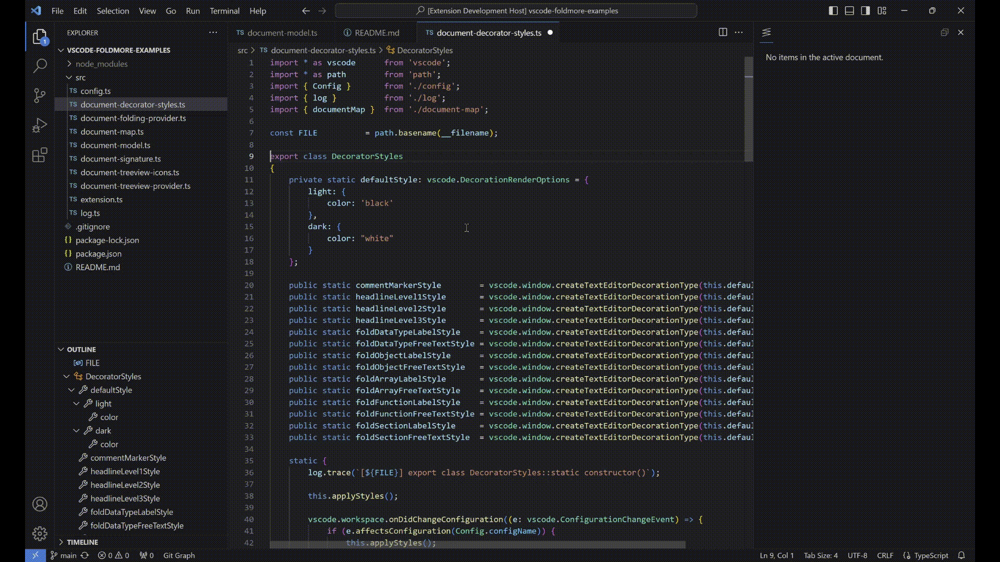
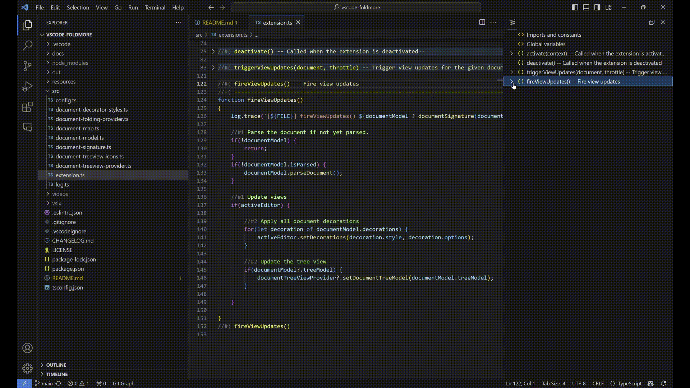
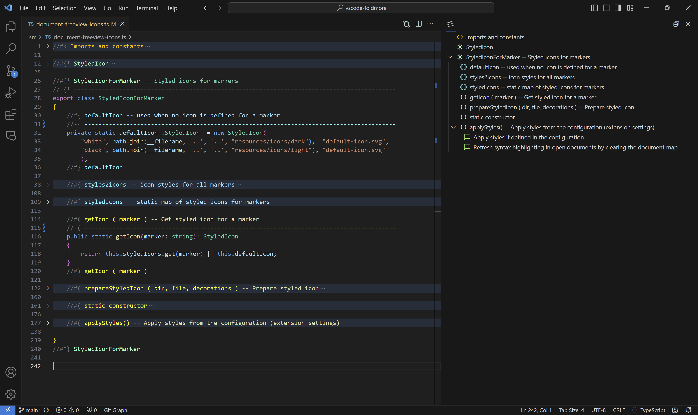
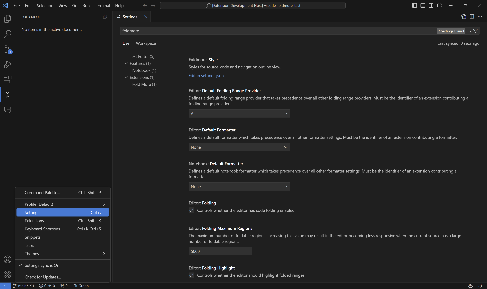
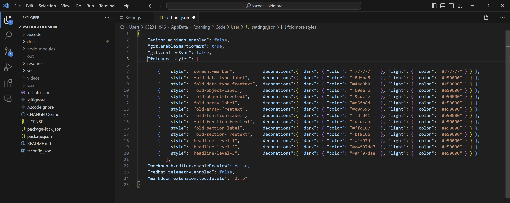

# Fold More

This extension for VS Code let's you:

1. Use the [folding](https://code.visualstudio.com/docs/editor/codebasics#_folding) feature of VS Code to define **_arbitrary and named folding regions_**
1. Define **_headlines_** for better code navigation and highlight significant points
1. Navigate faster in your code using **_region labels_** and **_headlines_** in the **_navigation tree view_**
1. Configure the **_marker colors_** for _region labels_ and _headlines_ in the extension settings
1. Add **_comments in marker colors_**. These comments do not appear in the _navigation tree view_

---

- [Features](#features)
  - [Arbitrary and Named Folding Regions](#arbitrary-and-named-folding-regions)
  - [Headlines](#headlines)
  - [Comments in Marker Colors](#comments-in-marker-colors)
  - [Navigation Tree View](#navigation-tree-view)
- [Supported Languages](#supported-languages)
- [Extension Settings](#extension-settings)
- [Release Notes](#release-notes)

## Features

### Arbitrary and Named Folding Regions

- Each region _marker_ must be on a separate line and start with `//#`.
- Each marker is expected to contain a **_region label_** that is used to build the _navigation tree view_ with the hierarchy of nested regions. Each _region start marker_ is expected to have a corresponsing _region end marker_ with the same _region label_.

You can use the following _markers_ to define _named folding regions_:

| Start marker | End marker | Suggested purpose                                 |
| ------------ | ---------- | ------------------------------------------------- |
| `//#{*`      | `//#*}`    | Data types, structures, ...                       |
| `//#{`       | `//#}`     | Variables, objects, instances, ...                |
| `//#[`       | `//#]`     | Arrays, lists, collections, tables, mappings, ... |
| `//#(`       | `//#)`     | Functions, methods, procedures, ...               |
| `//#<`       | `//#>`     | General purpose sections or regions               |

- You can use the markers as you like, the above purpose for the folding regions is only a suggestion.
- The _named regions_ will show in the _navigation tree view_ where you can collapse/expand the regions and navigate to them by the _region label_.

### Headlines

- You can define _headlines_ on three levels that will show in the _navigation tree view_ where you can navigate to them by the headline title.

| Marker | Headline         |
| -------| ---------------- |
| `//#1` | Headline level 1 |
| `//#2` | Headline level 2 |
| `//#3` | Headline level 3 |

### Comments in Marker Colors

- You can add comments in _marker colors_. These comments do not appear in the _navigation tree view_.

| Marker  | Color                  |
| ------- | ---------------------- |
| `//-1`  | Headline level 1 color |
| `//-2`  | Headline level 2 color |
| `//-3`  | Headline level 3 color |
| `//-{*` | `{* *}`   region color |
| `//-{`  | `{ }`     region color |
| `//-(`  | `( )`     region color |
| `//-[`  | `[ ]`     region color |
| `//-<`  | `< >`     region color |

### Navigation Tree View

- You can navigate faster in your code using _region labels_ and _headlines_ in the **_navigation tree view_**.
- You build the navigation tree explicitly by defining _named regions_ and _headlines_ of significance.
- To open the view, go to **View | Open View...** and search for **`Fold More`**

## Supported Languages

Currently supported languages (with C-style line-comments starting with `//`):

- JavaScript
- TypeScript

## Extension Settings

You can configure the _marker colors_ for _region labels_ and _headlines_ in the extension settings:

1. Open the Settings and search for `foldmore`

   

2. Click on `Edit settings.json` to edit the _styles_ (syntax and icon colors)

   

## Release Notes

See the [Change Log](CHANGELOG.md)
